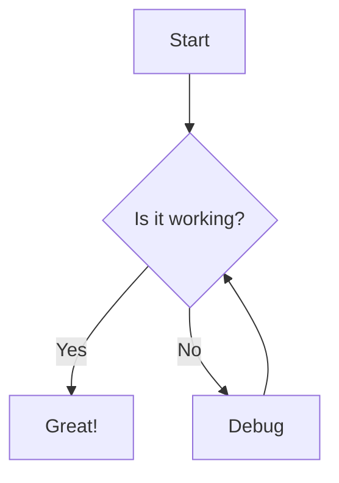
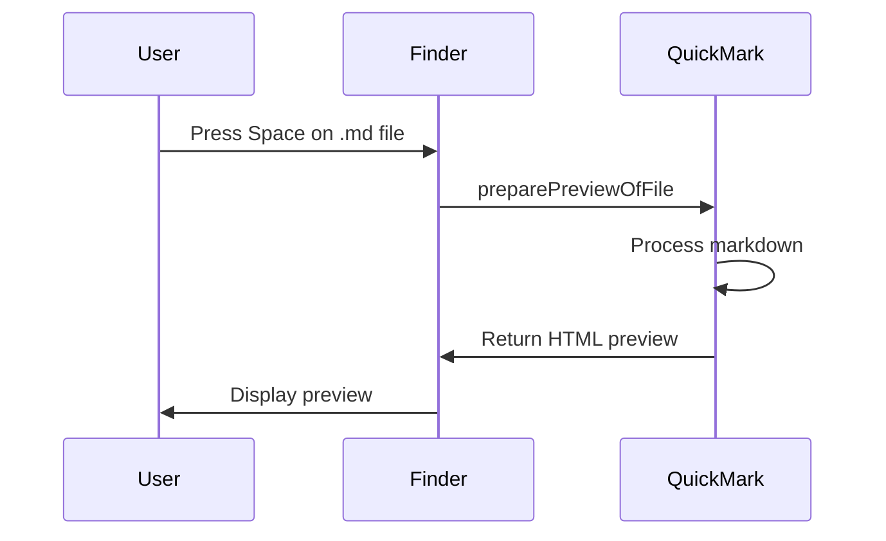
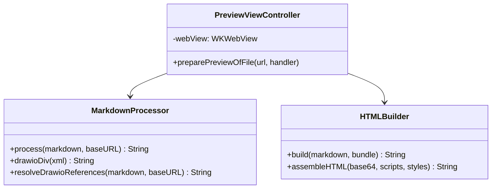

# Mermaid Diagrams

## Flowchart

```mermaid
graph TD
    A[Start] --> B{Is it working?}
    B -->|Yes| C[Great!]
    B -->|No| D[Debug]
    D --> B
```

## Sequence Diagram

```mermaid
sequenceDiagram
    participant U as User
    participant F as Finder
    participant Q as QuickMark
    U->>F: Press Space on .md file
    F->>Q: preparePreviewOfFile
    Q->>Q: Process markdown
    Q->>F: Return HTML preview
    F->>U: Display preview
```

## Class Diagram

```mermaid
classDiagram
    class MarkdownProcessor {
        +process(markdown, baseURL) String
        +drawioDiv(xml) String
        +resolveDrawioReferences(markdown, baseURL) String
    }
    class HTMLBuilder {
        +build(markdown, bundle) String
        +assembleHTML(base64, scripts, styles) String
    }
    class PreviewViewController {
        -webView: WKWebView
        +preparePreviewOfFile(url, handler)
    }
    PreviewViewController --> MarkdownProcessor
    PreviewViewController --> HTMLBuilder
```
