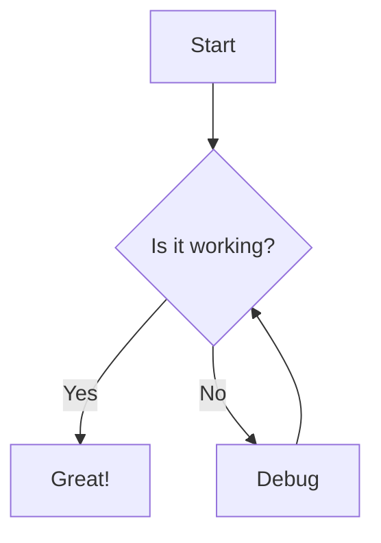
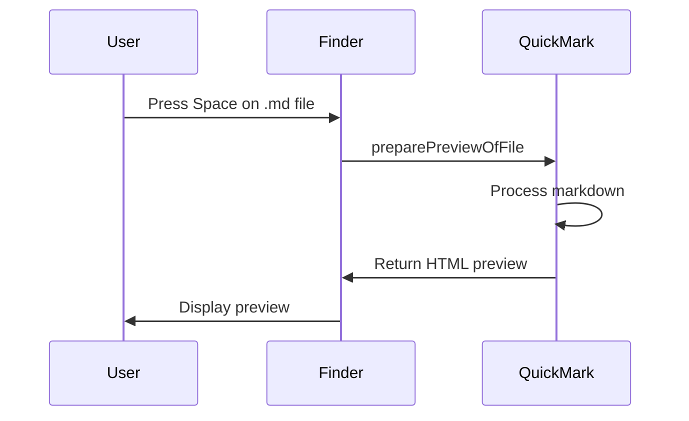
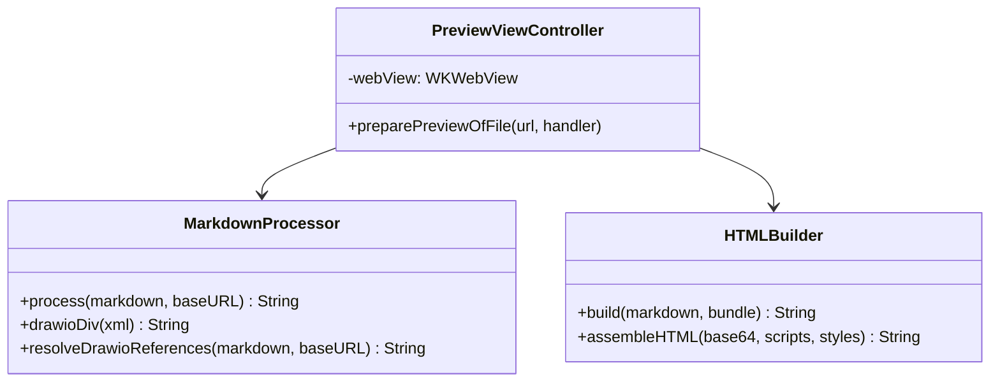

# QuickMark Implementation Plan

> **Historical:** This was the initial implementation plan. The final implementation uses `Markdown/`, `DrawIO/`, and `Structured/` directories (not `QuickMarkPreview/`), three extension targets instead of one, and file URL references instead of inlined JS. See the codebase and CLAUDE.md for current architecture.

> **For agentic workers:** REQUIRED: Use superpowers:subagent-driven-development (if subagents available) or superpowers:executing-plans to implement this plan. Steps use checkbox (`- [ ]`) syntax for tracking.

**Goal:** Build a macOS QuickLook extension that previews markdown files with GFM support, syntax highlighting, mermaid diagrams, LaTeX math, draw.io diagrams, and light/dark mode.

**Architecture:** Two-target Xcode project (host app + QL preview extension). The extension reads markdown, preprocesses draw.io references, assembles a self-contained HTML document with all JS/CSS inlined, and displays it in a WKWebView. All rendering is client-side via bundled JavaScript libraries.

**Tech Stack:** Swift 5.9+, SwiftUI (host app), WebKit/WKWebView (extension), XcodeGen (project generation). JS: markdown-it, highlight.js, KaTeX, markdown-it-texmath, mermaid.js, diagrams.net viewer.

---

## File Structure

```
QuickMark/
├── project.yml                              # XcodeGen project definition
├── scripts/
│   ├── download-libs.sh                     # Downloads all JS/CSS libraries
│   └── inline-katex-fonts.py                # Inlines KaTeX font files as base64 data URIs
├── QuickMark/                               # Host app target
│   ├── QuickMarkApp.swift                   # App entry point
│   ├── ContentView.swift                    # "Extension installed" screen
│   ├── Assets.xcassets/                     # App icon
│   │   └── Contents.json
│   └── Info.plist
├── QuickMarkPreview/                        # QuickLook extension target
│   ├── PreviewViewController.swift          # QLPreviewingController + WKWebView
│   ├── MarkdownProcessor.swift              # Draw.io preprocessing
│   ├── HTMLBuilder.swift                    # Assembles complete HTML document
│   ├── Resources/
│   │   ├── markdown-it.min.js              # Downloaded
│   │   ├── markdown-it-task-lists.min.js   # Downloaded
│   │   ├── markdown-it-footnote.min.js     # Downloaded
│   │   ├── texmath.min.js                  # Downloaded
│   │   ├── texmath.min.css                 # Downloaded
│   │   ├── highlight.min.js               # Downloaded
│   │   ├── katex.min.js                    # Downloaded
│   │   ├── katex-inlined.min.css           # Generated (fonts base64-inlined)
│   │   ├── hljs-themes.css                 # Generated (github light+dark in media queries)
│   │   ├── mermaid.min.js                  # Downloaded
│   │   ├── viewer-static.min.js            # Downloaded (draw.io)
│   │   ├── render.js                       # Our rendering script
│   │   └── style.css                       # Our styles (layout, typography, light/dark)
│   ├── Info.plist
│   └── QuickMarkPreview.entitlements
├── QuickMarkTests/                          # Unit tests
│   ├── MarkdownProcessorTests.swift
│   └── HTMLBuilderTests.swift
├── TestFiles/                               # Manual test markdown files
│   ├── basic.md
│   ├── code-blocks.md
│   ├── mermaid-test.md
│   ├── math-test.md
│   ├── images/
│   │   └── sample.png
│   ├── drawio-test.md
│   └── sample.drawio
├── LICENSE.txt
└── .gitignore
```

## Prerequisites

- macOS 12.0+ (deployment target)
- Xcode 15+ with command-line tools
- XcodeGen (`brew install xcodegen`)
- Python 3 (ships with macOS, used by font inlining script)
- curl (ships with macOS)
- An Apple Developer account (for code signing)

---

## Chunk 1: Project Foundation

### Task 1: Directory Structure + XcodeGen Project

**Files:**
- Create: `project.yml`
- Create: `QuickMark/Info.plist`
- Create: `QuickMark/Assets.xcassets/Contents.json`
- Create: `QuickMarkPreview/Info.plist`
- Create: `QuickMarkPreview/QuickMarkPreview.entitlements`
- Create: `QuickMarkTests/` (empty directory, populated in later tasks)
- Create: `TestFiles/` (empty directory, populated in later tasks)

- [ ] **Step 1: Install XcodeGen**

```bash
brew install xcodegen
```

Expected: XcodeGen installed (or already present).

- [ ] **Step 2: Create directory structure**

```bash
mkdir -p QuickMark/Assets.xcassets
mkdir -p QuickMarkPreview/Resources
mkdir -p QuickMarkTests
mkdir -p TestFiles/images
mkdir -p scripts
```

- [ ] **Step 3: Write `project.yml`**

```yaml
name: QuickMark
options:
  bundleIdPrefix: com.quickmark
  deploymentTarget:
    macOS: "12.0"
  xcodeVersion: "15.0"
settings:
  base:
    SWIFT_VERSION: "5.9"
    CODE_SIGN_STYLE: Automatic
targets:
  QuickMark:
    type: application
    platform: macOS
    sources:
      - path: QuickMark
    info:
      path: QuickMark/Info.plist
    dependencies:
      - target: QuickMarkPreview
        embed: true
        codeSign: true
  QuickMarkPreview:
    type: app-extension
    platform: macOS
    sources:
      - path: QuickMarkPreview
        excludes:
          - "Resources/**"
    resources:
      - path: QuickMarkPreview/Resources
    info:
      path: QuickMarkPreview/Info.plist
    entitlements:
      path: QuickMarkPreview/QuickMarkPreview.entitlements
    settings:
      PRODUCT_BUNDLE_IDENTIFIER: com.quickmark.QuickMark.QuickMarkPreview
  QuickMarkTests:
    type: bundle.unit-test
    platform: macOS
    sources:
      - path: QuickMarkTests
      - path: QuickMarkPreview/MarkdownProcessor.swift
        type: file
      - path: QuickMarkPreview/HTMLBuilder.swift
        type: file
```

- [ ] **Step 4: Write `QuickMark/Info.plist`**

```xml
<?xml version="1.0" encoding="UTF-8"?>
<!DOCTYPE plist PUBLIC "-//Apple//DTD PLIST 1.0//EN" "http://www.apple.com/DTDs/PropertyList-1.0.dtd">
<plist version="1.0">
<dict>
    <key>CFBundleName</key>
    <string>QuickMark</string>
    <key>CFBundleIdentifier</key>
    <string>$(PRODUCT_BUNDLE_IDENTIFIER)</string>
    <key>CFBundleVersion</key>
    <string>1</string>
    <key>CFBundleShortVersionString</key>
    <string>1.0</string>
    <key>CFBundlePackageType</key>
    <string>APPL</string>
    <key>LSMinimumSystemVersion</key>
    <string>$(MACOSX_DEPLOYMENT_TARGET)</string>
    <key>CFBundleExecutable</key>
    <string>$(EXECUTABLE_NAME)</string>
</dict>
</plist>
```

- [ ] **Step 5: Write `QuickMark/Assets.xcassets/Contents.json`**

```json
{
  "info" : {
    "author" : "xcode",
    "version" : 1
  }
}
```

- [ ] **Step 6: Write `QuickMarkPreview/Info.plist`**

```xml
<?xml version="1.0" encoding="UTF-8"?>
<!DOCTYPE plist PUBLIC "-//Apple//DTD PLIST 1.0//EN" "http://www.apple.com/DTDs/PropertyList-1.0.dtd">
<plist version="1.0">
<dict>
    <key>CFBundleName</key>
    <string>QuickMarkPreview</string>
    <key>CFBundleIdentifier</key>
    <string>$(PRODUCT_BUNDLE_IDENTIFIER)</string>
    <key>CFBundleVersion</key>
    <string>1</string>
    <key>CFBundleShortVersionString</key>
    <string>1.0</string>
    <key>CFBundlePackageType</key>
    <string>XPC!</string>
    <key>LSMinimumSystemVersion</key>
    <string>$(MACOSX_DEPLOYMENT_TARGET)</string>
    <key>CFBundleExecutable</key>
    <string>$(EXECUTABLE_NAME)</string>
    <key>NSExtension</key>
    <dict>
        <key>NSExtensionAttributes</key>
        <dict>
            <key>QLSupportedContentTypes</key>
            <array>
                <string>public.markdown</string>
                <string>net.daringfireball.markdown</string>
                <string>net.ia.markdown</string>
                <string>com.unknown.md</string>
                <string>io.typora.markdown</string>
                <string>com.nutstore.down</string>
                <string>com.rstudio.rmarkdown</string>
                <string>org.quarto.qmarkdown</string>
                <string>org.apiblueprint.file</string>
                <string>org.textbundle.package</string>
            </array>
        </dict>
        <key>NSExtensionPointIdentifier</key>
        <string>com.apple.quicklook.preview</string>
        <key>NSExtensionPrincipalClass</key>
        <string>$(PRODUCT_MODULE_NAME).PreviewViewController</string>
    </dict>
</dict>
</plist>
```

- [ ] **Step 7: Write `QuickMarkPreview/QuickMarkPreview.entitlements`**

```xml
<?xml version="1.0" encoding="UTF-8"?>
<!DOCTYPE plist PUBLIC "-//Apple//DTD PLIST 1.0//EN" "http://www.apple.com/DTDs/PropertyList-1.0.dtd">
<plist version="1.0">
<dict>
    <key>com.apple.security.app-sandbox</key>
    <true/>
    <key>com.apple.security.network.client</key>
    <true/>
    <key>com.apple.security.files.user-selected.read-only</key>
    <true/>
    <key>com.apple.security.temporary-exception.files.absolute-path.read-only</key>
    <array>
        <string>/</string>
    </array>
</dict>
</plist>
```

Note: `com.apple.security.network.client` is required for WKWebView to function inside app extensions, even when loading only local content. This is an addition beyond what the spec lists — WKWebView's out-of-process architecture needs it to launch its web process.

- [ ] **Step 8: Create placeholder Swift files for project generation**

Write minimal placeholder files so XcodeGen can generate the project. These are replaced in later tasks.

`QuickMark/QuickMarkApp.swift`:
```swift
import SwiftUI

@main
struct QuickMarkApp: App {
    var body: some Scene {
        WindowGroup {
            Text("QuickMark")
        }
    }
}
```

`QuickMark/ContentView.swift`:
```swift
import SwiftUI

struct ContentView: View {
    var body: some View {
        Text("QuickMark")
    }
}
```

`QuickMarkPreview/PreviewViewController.swift`:
```swift
import Cocoa
import Quartz

class PreviewViewController: NSViewController, QLPreviewingController {
    override func loadView() {
        self.view = NSView()
    }

    func preparePreviewOfFile(at url: URL, completionHandler handler: @escaping (Error?) -> Void) {
        handler(nil)
    }
}
```

`QuickMarkPreview/MarkdownProcessor.swift`:
```swift
import Foundation

struct MarkdownProcessor {
}
```

`QuickMarkPreview/HTMLBuilder.swift`:
```swift
import Foundation

struct HTMLBuilder {
}
```

`QuickMarkTests/MarkdownProcessorTests.swift`:
```swift
import XCTest

class MarkdownProcessorTests: XCTestCase {
}
```

`QuickMarkTests/HTMLBuilderTests.swift`:
```swift
import XCTest

class HTMLBuilderTests: XCTestCase {
}
```

- [ ] **Step 9: Generate Xcode project**

```bash
xcodegen generate
```

Expected: `QuickMark.xcodeproj` is created. Open it in Xcode and verify both targets are listed.

- [ ] **Step 10: Build to verify project structure**

```bash
xcodebuild -project QuickMark.xcodeproj -scheme QuickMark build
```

Expected: Build succeeds. If code signing fails, set your development team in Xcode or add `DEVELOPMENT_TEAM` to project.yml settings.

- [ ] **Step 11: Commit**

```bash
git add project.yml QuickMark/ QuickMarkPreview/ QuickMarkTests/ scripts/
git commit -m "feat: scaffold Xcode project with XcodeGen

Two-target project: QuickMark host app + QuickMarkPreview extension.
Includes test target, entitlements, and Info.plists."
```

---

### Task 2: Download and Bundle JS/CSS Libraries

**Files:**
- Create: `scripts/download-libs.sh`
- Create: `scripts/inline-katex-fonts.py`
- Populates: `QuickMarkPreview/Resources/` (all downloaded/generated files)

- [ ] **Step 1: Write `scripts/inline-katex-fonts.py`**

```python
#!/usr/bin/env python3
"""Inline font url() references in KaTeX CSS as base64 data URIs."""
import base64
import re
import sys
from pathlib import Path

def main():
    css_path = Path(sys.argv[1])
    css = css_path.read_text()

    def replace_url(match):
        raw = match.group(1).strip().strip("'\"")
        if not raw.startswith("fonts/"):
            return match.group(0)
        font_path = css_path.parent / raw
        if not font_path.exists():
            print(f"Warning: font not found: {font_path}", file=sys.stderr)
            return match.group(0)
        data = base64.b64encode(font_path.read_bytes()).decode()
        ext = font_path.suffix.lstrip(".")
        mime = {"woff2": "font/woff2", "woff": "font/woff", "ttf": "font/ttf"}.get(ext, f"font/{ext}")
        return f'url("data:{mime};base64,{data}")'

    result = re.sub(r"url\(([^)]+)\)", replace_url, css)
    sys.stdout.write(result)

if __name__ == "__main__":
    main()
```

- [ ] **Step 2: Write `scripts/download-libs.sh`**

```bash
#!/usr/bin/env bash
set -euo pipefail

RESOURCES_DIR="QuickMarkPreview/Resources"
TEMP_DIR=$(mktemp -d)
trap 'rm -rf "$TEMP_DIR"' EXIT

echo "Downloading JS/CSS libraries..."

# --- markdown-it and plugins ---
curl -sLo "$RESOURCES_DIR/markdown-it.min.js" \
  "https://cdn.jsdelivr.net/npm/markdown-it@14/dist/markdown-it.min.js"
echo "  markdown-it ✓"

curl -sLo "$RESOURCES_DIR/markdown-it-task-lists.min.js" \
  "https://cdn.jsdelivr.net/npm/markdown-it-task-lists@2/dist/markdown-it-task-lists.min.js"
echo "  markdown-it-task-lists ✓"

curl -sLo "$RESOURCES_DIR/markdown-it-footnote.min.js" \
  "https://cdn.jsdelivr.net/npm/markdown-it-footnote@4/dist/markdown-it-footnote.min.js"
echo "  markdown-it-footnote ✓"

# --- markdown-it-texmath ---
curl -sLo "$RESOURCES_DIR/texmath.min.js" \
  "https://cdn.jsdelivr.net/npm/markdown-it-texmath@1/texmath.min.js"
curl -sLo "$RESOURCES_DIR/texmath.min.css" \
  "https://cdn.jsdelivr.net/npm/markdown-it-texmath@1/css/texmath.min.css"
echo "  texmath ✓"

# --- highlight.js ---
HLJS_VER="11"
curl -sLo "$RESOURCES_DIR/highlight.min.js" \
  "https://cdn.jsdelivr.net/gh/highlightjs/cdn-release@$HLJS_VER/build/highlight.min.js"
curl -sLo "$TEMP_DIR/github.min.css" \
  "https://cdn.jsdelivr.net/gh/highlightjs/cdn-release@$HLJS_VER/build/styles/github.min.css"
curl -sLo "$TEMP_DIR/github-dark.min.css" \
  "https://cdn.jsdelivr.net/gh/highlightjs/cdn-release@$HLJS_VER/build/styles/github-dark.min.css"

# Combine hljs themes into media-query-wrapped stylesheet
{
  echo "@media (prefers-color-scheme: light) {"
  cat "$TEMP_DIR/github.min.css"
  echo "}"
  echo "@media (prefers-color-scheme: dark) {"
  cat "$TEMP_DIR/github-dark.min.css"
  echo "}"
} > "$RESOURCES_DIR/hljs-themes.css"
echo "  highlight.js ✓"

# --- KaTeX ---
KATEX_VER="0.16"
KATEX_BASE="https://cdn.jsdelivr.net/npm/katex@$KATEX_VER/dist"
curl -sLo "$RESOURCES_DIR/katex.min.js" "$KATEX_BASE/katex.min.js"
curl -sLo "$TEMP_DIR/katex.min.css" "$KATEX_BASE/katex.min.css"

# Download all fonts referenced in the CSS
mkdir -p "$TEMP_DIR/fonts"
grep -oE 'url\([^)]*fonts/[^)]+\)' "$TEMP_DIR/katex.min.css" | \
  sed 's/url(//;s/)//;s/"//g;s/'"'"'//g' | sort -u | while read -r font_path; do
    curl -sLo "$TEMP_DIR/$font_path" "$KATEX_BASE/$font_path"
done

# Inline fonts as base64 data URIs
python3 scripts/inline-katex-fonts.py "$TEMP_DIR/katex.min.css" \
  > "$RESOURCES_DIR/katex-inlined.min.css"
echo "  KaTeX (with inlined fonts) ✓"

# --- mermaid ---
curl -sLo "$RESOURCES_DIR/mermaid.min.js" \
  "https://cdn.jsdelivr.net/npm/mermaid@11/dist/mermaid.min.js"
echo "  mermaid ✓"

# --- draw.io viewer ---
curl -sLo "$RESOURCES_DIR/viewer-static.min.js" \
  "https://viewer.diagrams.net/js/viewer-static.min.js"
echo "  draw.io viewer ✓"

echo ""
echo "All libraries downloaded to $RESOURCES_DIR/"
ls -lh "$RESOURCES_DIR/"
```

- [ ] **Step 3: Make scripts executable and run**

```bash
chmod +x scripts/download-libs.sh scripts/inline-katex-fonts.py
./scripts/download-libs.sh
```

Expected: All files downloaded to `QuickMarkPreview/Resources/`. Verify with `ls QuickMarkPreview/Resources/` — should list 11 files (9 JS + 2 CSS; `render.js` and `style.css` are created in later tasks).

- [ ] **Step 4: Verify file sizes are reasonable**

```bash
du -sh QuickMarkPreview/Resources/*
```

Expected approximate sizes: markdown-it ~100KB, highlight.js ~300KB, katex.min.js ~300KB, katex-inlined.min.css ~1-3MB (with fonts), mermaid ~1.5MB, viewer-static ~2-3MB. If any file is 0 bytes or suspiciously small, the download URL may be wrong — check manually.

- [ ] **Step 5: Commit**

```bash
git add scripts/ QuickMarkPreview/Resources/*.js QuickMarkPreview/Resources/*.css
git commit -m "feat: add JS/CSS library download scripts and bundled resources

Downloads markdown-it, highlight.js, KaTeX (with inlined fonts),
mermaid.js, draw.io viewer, and markdown-it plugins."
```

---

### Task 3: Minimal Host App

**Files:**
- Modify: `QuickMark/QuickMarkApp.swift`
- Modify: `QuickMark/ContentView.swift`

- [ ] **Step 1: Write `QuickMark/QuickMarkApp.swift`**

```swift
import SwiftUI

@main
struct QuickMarkApp: App {
    var body: some Scene {
        WindowGroup {
            ContentView()
        }
    }
}
```

- [ ] **Step 2: Write `QuickMark/ContentView.swift`**

```swift
import SwiftUI

struct ContentView: View {
    var body: some View {
        VStack(spacing: 16) {
            Image(nsImage: NSApp.applicationIconImage)
                .resizable()
                .frame(width: 128, height: 128)

            Text("QuickMark")
                .font(.largeTitle)
                .fontWeight(.semibold)

            Text("This app provides a QuickLook preview extension for Markdown files. It's already active — just select a .md file in Finder and press Space.")
                .font(.body)
                .foregroundStyle(.secondary)
                .multilineTextAlignment(.center)
                .frame(maxWidth: 400)
        }
        .padding(40)
        .frame(width: 480, height: 300)
    }
}
```

- [ ] **Step 3: Build**

```bash
xcodebuild -project QuickMark.xcodeproj -scheme QuickMark build
```

Expected: Build succeeds. Launch the app to verify the UI appears correctly.

- [ ] **Step 4: Commit**

```bash
git add QuickMark/
git commit -m "feat: minimal host app with installation instructions"
```

---

## Chunk 2: Rendering Engine

### Task 4: CSS (Light/Dark Theme)

**Files:**
- Create: `QuickMarkPreview/Resources/style.css`

- [ ] **Step 1: Write `QuickMarkPreview/Resources/style.css`**

```css
:root {
    --text: #24292f;
    --bg: #ffffff;
    --secondary: #656d76;
    --border: #d0d7de;
    --code-bg: #f6f8fa;
    --blockquote-border: #d0d7de;
    --link: #0969da;
    --table-border: #d0d7de;
    --table-alt-bg: #f6f8fa;
}

@media (prefers-color-scheme: dark) {
    :root {
        --text: #e6edf3;
        --bg: #0d1117;
        --secondary: #8b949e;
        --border: #30363d;
        --code-bg: #161b22;
        --blockquote-border: #30363d;
        --link: #58a6ff;
        --table-border: #30363d;
        --table-alt-bg: #161b22;
    }
}

* {
    box-sizing: border-box;
}

html {
    font-size: 16px;
}

body {
    font-family: -apple-system, BlinkMacSystemFont, "Segoe UI", Helvetica, Arial, sans-serif;
    line-height: 1.6;
    color: var(--text);
    background: var(--bg);
    margin: 0;
    padding: 32px;
    word-wrap: break-word;
}

article {
    max-width: 880px;
    margin: 0 auto;
}

/* --- Headings --- */

h1, h2, h3, h4, h5, h6 {
    margin-top: 24px;
    margin-bottom: 16px;
    font-weight: 600;
    line-height: 1.25;
}

h1 { font-size: 2em; padding-bottom: 0.3em; border-bottom: 1px solid var(--border); }
h2 { font-size: 1.5em; padding-bottom: 0.3em; border-bottom: 1px solid var(--border); }
h3 { font-size: 1.25em; }
h4 { font-size: 1em; }

/* --- Paragraphs & inline --- */

p { margin-top: 0; margin-bottom: 16px; }
a { color: var(--link); text-decoration: none; }
a:hover { text-decoration: underline; }
strong { font-weight: 600; }
img { max-width: 100%; height: auto; }
hr { height: 0.25em; padding: 0; margin: 24px 0; background: var(--border); border: 0; }

/* --- Code --- */

code {
    padding: 0.2em 0.4em;
    font-size: 85%;
    background: var(--code-bg);
    border-radius: 6px;
    font-family: ui-monospace, SFMono-Regular, "SF Mono", Menlo, monospace;
}

pre {
    padding: 16px;
    overflow: auto;
    font-size: 85%;
    line-height: 1.45;
    background: var(--code-bg);
    border-radius: 6px;
    margin-bottom: 16px;
}

pre code {
    padding: 0;
    background: transparent;
    border-radius: 0;
}

/* --- Blockquotes --- */

blockquote {
    margin: 0 0 16px 0;
    padding: 0 1em;
    color: var(--secondary);
    border-left: 0.25em solid var(--blockquote-border);
}

/* --- Tables --- */

table {
    border-collapse: collapse;
    width: 100%;
    margin-bottom: 16px;
}

th, td {
    padding: 6px 13px;
    border: 1px solid var(--table-border);
}

th { font-weight: 600; }
tr:nth-child(even) { background: var(--table-alt-bg); }

/* --- Lists --- */

ul, ol { padding-left: 2em; margin-bottom: 16px; }
li + li { margin-top: 0.25em; }

/* --- Task lists --- */

.task-list-item {
    list-style-type: none;
    margin-left: -1.5em;
}

.task-list-item input[type="checkbox"] {
    margin-right: 0.5em;
    pointer-events: none;
}

/* --- Mermaid --- */

.mermaid {
    text-align: center;
    margin: 16px 0;
}

/* --- Draw.io --- */

.mxgraph {
    margin: 16px 0;
    max-width: 100%;
}

/* --- Footnotes --- */

.footnotes {
    font-size: 0.875em;
    margin-top: 2em;
    border-top: 1px solid var(--border);
    padding-top: 1em;
}

.footnotes ol { padding-left: 1.5em; }

/* --- Math (KaTeX) --- */

.katex-display {
    overflow-x: auto;
    overflow-y: hidden;
    padding: 8px 0;
}
```

- [ ] **Step 2: Commit**

```bash
git add QuickMarkPreview/Resources/style.css
git commit -m "feat: add stylesheet with light/dark mode support"
```

---

### Task 5: Client-Side Render Script

**Files:**
- Create: `QuickMarkPreview/Resources/render.js`

- [ ] **Step 1: Write `QuickMarkPreview/Resources/render.js`**

```javascript
(function() {
    "use strict";

    // Detect dark mode for mermaid theme
    var isDark = window.matchMedia("(prefers-color-scheme: dark)").matches;

    // Initialize markdown-it with plugins
    var md = markdownit({
        html: true,
        linkify: true,
        typographer: false,
        highlight: function(str, lang) {
            if (lang && hljs.getLanguage(lang)) {
                try {
                    return hljs.highlight(str, { language: lang }).value;
                } catch (_) {}
            }
            return "";
        }
    });

    // Register plugins
    // Note: the global name may be markdownItTaskLists (capital I) depending on
    // the version downloaded. Verify against the actual .min.js file and adjust.
    var taskListPlugin = window.markdownitTaskLists || window.markdownItTaskLists;
    if (taskListPlugin) md.use(taskListPlugin, { enabled: true, label: true });
    md.use(markdownitFootnote);

    md.use(texmath, { engine: katex, delimiters: "dollars", katexOptions: { throwOnError: false } });

    // Custom fence rule: render mermaid blocks as divs instead of <pre><code>
    // Mermaid expects raw diagram text — do NOT HTML-escape (arrows like --> would break)
    var defaultFence = md.renderer.rules.fence.bind(md.renderer.rules);
    md.renderer.rules.fence = function(tokens, idx, options, env, self) {
        var token = tokens[idx];
        if (token.info.trim() === "mermaid") {
            return '<div class="mermaid">' + token.content + "</div>\n";
        }
        return defaultFence(tokens, idx, options, env, self);
    };

    // Decode base64 markdown source and render
    var sourceEl = document.getElementById("markdown-source");
    var source = atob(sourceEl.textContent.trim());
    document.getElementById("content").innerHTML = md.render(source);

    // Initialize mermaid
    mermaid.initialize({
        startOnLoad: false,
        theme: isDark ? "dark" : "default",
        securityLevel: "loose"
    });
    mermaid.run();

    // Initialize draw.io viewer (if any .mxgraph elements exist)
    if (typeof GraphViewer !== "undefined" && document.querySelector(".mxgraph")) {
        GraphViewer.processElements();
    }
})();
```

- [ ] **Step 2: Commit**

```bash
git add QuickMarkPreview/Resources/render.js
git commit -m "feat: add client-side markdown rendering script

Initializes markdown-it with GFM plugins, highlight.js, KaTeX math,
mermaid diagrams, and draw.io viewer."
```

---

### Task 6: MarkdownProcessor (TDD)

**Files:**
- Modify: `QuickMarkPreview/MarkdownProcessor.swift`
- Modify: `QuickMarkTests/MarkdownProcessorTests.swift`

- [ ] **Step 1: Write failing test for `drawioDiv`**

`QuickMarkTests/MarkdownProcessorTests.swift`:
```swift
import XCTest

class MarkdownProcessorTests: XCTestCase {

    func testDrawioDivWrapsXmlInMxgraphDiv() {
        let xml = "<mxfile><diagram>test</diagram></mxfile>"
        let result = MarkdownProcessor.drawioDiv(xml: xml)

        XCTAssertTrue(result.contains("class=\"mxgraph\""), "Should have mxgraph class")
        XCTAssertTrue(result.contains("data-mxgraph="), "Should have data attribute")
        // The XML is JSON-escaped then HTML-attribute-escaped, so angle brackets
        // are preserved but quotes become escaped sequences
        XCTAssertTrue(result.contains("mxfile"), "Should reference the XML content")
    }

    func testDrawioDivEscapesQuotesInXml() {
        let xml = "<mxfile attr=\"value\">content</mxfile>"
        let result = MarkdownProcessor.drawioDiv(xml: xml)

        // Quotes in XML must be JSON-escaped (for the JSON value) then
        // HTML-attribute-escaped (for the data attribute)
        XCTAssertTrue(result.contains("mxgraph"), "Should produce mxgraph div")
        // The raw unescaped attr="value" should not appear in the output
        XCTAssertFalse(result.contains("attr=\"value\">"), "Raw quotes must be escaped")
    }

    func testDrawioDivMissingFileReturnsUnchanged() {
        let markdown = ""
        let baseURL = URL(fileURLWithPath: "/tmp/empty")
        let result = MarkdownProcessor.resolveDrawioReferences(markdown, baseURL: baseURL)

        XCTAssertEqual(result, markdown, "Missing file should leave reference unchanged")
    }
}
```

- [ ] **Step 2: Run test to verify it fails**

```bash
xcodebuild test -project QuickMark.xcodeproj -scheme QuickMarkTests -destination 'platform=macOS' 2>&1 | tail -20
```

Expected: FAIL — `Type 'MarkdownProcessor' has no member 'drawioDiv'`

- [ ] **Step 3: Implement `drawioDiv` in `MarkdownProcessor.swift`**

```swift
import Foundation

struct MarkdownProcessor {

    /// Creates an HTML div that the draw.io viewer will render.
    /// Escaping strategy:
    /// 1. JSON-escape the XML (escape \, ", newlines, tabs)
    /// 2. Build the JSON object string
    /// 3. HTML-attribute-escape the JSON string (escape & and ")
    static func drawioDiv(xml: String) -> String {
        // Step 1: JSON-escape the XML for embedding as a JSON string value
        let jsonEscaped = xml
            .replacingOccurrences(of: "\\", with: "\\\\")
            .replacingOccurrences(of: "\"", with: "\\\"")
            .replacingOccurrences(of: "\n", with: "\\n")
            .replacingOccurrences(of: "\r", with: "\\r")
            .replacingOccurrences(of: "\t", with: "\\t")

        // Step 2: Build JSON object
        let json = "{\"highlight\":\"#0000ff\",\"nav\":true,\"resize\":true,\"xml\":\"\(jsonEscaped)\"}"

        // Step 3: HTML-attribute-escape the JSON for use in data-mxgraph="..."
        let htmlEscaped = json
            .replacingOccurrences(of: "&", with: "&amp;")
            .replacingOccurrences(of: "\"", with: "&quot;")

        return "<div class=\"mxgraph\" data-mxgraph=\"\(htmlEscaped)\"></div>"
    }
}
```

- [ ] **Step 4: Run test to verify it passes**

```bash
xcodebuild test -project QuickMark.xcodeproj -scheme QuickMarkTests -destination 'platform=macOS' 2>&1 | tail -20
```

Expected: PASS (3 tests)

- [ ] **Step 5: Write failing test for `resolveDrawioReferences`**

Add to `MarkdownProcessorTests.swift`:
```swift
    func testResolveDrawioReferencesReplacesImageRef() throws {
        // Create a temporary .drawio file
        let tempDir = FileManager.default.temporaryDirectory
            .appendingPathComponent(UUID().uuidString)
        try FileManager.default.createDirectory(at: tempDir, withIntermediateDirectories: true)
        defer { try? FileManager.default.removeItem(at: tempDir) }

        let drawioContent = "<mxfile><diagram>test</diagram></mxfile>"
        let drawioFile = tempDir.appendingPathComponent("diagram.drawio")
        try drawioContent.write(to: drawioFile, atomically: true, encoding: .utf8)

        let markdown = "Check this out:\n\n\n\nEnd."
        let result = MarkdownProcessor.resolveDrawioReferences(markdown, baseURL: tempDir)

        XCTAssertFalse(result.contains(""), "Image ref should be replaced")
        XCTAssertTrue(result.contains("class=\"mxgraph\""), "Should contain draw.io div")
        XCTAssertTrue(result.contains("End."), "Other content should be preserved")
    }

    func testResolveDrawioReferencesIgnoresNonDrawioImages() {
        let markdown = ""
        let baseURL = URL(fileURLWithPath: "/tmp")
        let result = MarkdownProcessor.resolveDrawioReferences(markdown, baseURL: baseURL)

        XCTAssertEqual(result, markdown, "Non-drawio images should be unchanged")
    }

    func testResolveDrawioReferencesHandlesMultipleRefs() throws {
        let tempDir = FileManager.default.temporaryDirectory
            .appendingPathComponent(UUID().uuidString)
        try FileManager.default.createDirectory(at: tempDir, withIntermediateDirectories: true)
        defer { try? FileManager.default.removeItem(at: tempDir) }

        try "<mxfile>one</mxfile>".write(
            to: tempDir.appendingPathComponent("a.drawio"), atomically: true, encoding: .utf8)
        try "<mxfile>two</mxfile>".write(
            to: tempDir.appendingPathComponent("b.drawio"), atomically: true, encoding: .utf8)

        let markdown = "\ntext\n"
        let result = MarkdownProcessor.resolveDrawioReferences(markdown, baseURL: tempDir)

        XCTAssertFalse(result.contains("![A]"), "First ref should be replaced")
        XCTAssertFalse(result.contains("![B]"), "Second ref should be replaced")
        XCTAssertTrue(result.contains("text"), "Surrounding text should be preserved")
        // Should contain two mxgraph divs
        let divCount = result.components(separatedBy: "class=\"mxgraph\"").count - 1
        XCTAssertEqual(divCount, 2, "Should have two mxgraph divs")
    }
```

- [ ] **Step 6: Run test to verify it fails**

```bash
xcodebuild test -project QuickMark.xcodeproj -scheme QuickMarkTests -destination 'platform=macOS' 2>&1 | tail -20
```

Expected: FAIL — `Type 'MarkdownProcessor' has no member 'resolveDrawioReferences'`

- [ ] **Step 7: Implement `resolveDrawioReferences`**

Add to `MarkdownProcessor.swift`:
```swift
    /// Pattern matches `` in markdown
    private static let drawioPattern = try! NSRegularExpression(
        pattern: #"!\[([^\]]*)\]\(([^)]+\.drawio)\)"#,
        options: []
    )

    /// Replaces `` references with draw.io viewer divs.
    /// Reads the .drawio XML file from disk and embeds it inline.
    static func resolveDrawioReferences(_ markdown: String, baseURL: URL) -> String {
        let nsMarkdown = markdown as NSString
        let matches = drawioPattern.matches(in: markdown, range: NSRange(location: 0, length: nsMarkdown.length))

        var result = markdown
        // Process matches in reverse order to preserve indices
        for match in matches.reversed() {
            let pathRange = match.range(at: 2)
            let relativePath = nsMarkdown.substring(with: pathRange)
            let fileURL = baseURL.appendingPathComponent(relativePath)

            guard let xml = try? String(contentsOf: fileURL, encoding: .utf8) else {
                continue // Leave the reference as-is if file can't be read
            }

            let fullRange = match.range(at: 0)
            let div = drawioDiv(xml: xml)
            let swiftRange = Range(fullRange, in: result)!
            result.replaceSubrange(swiftRange, with: div)
        }

        return result
    }

    /// Entry point: preprocesses markdown before HTML rendering.
    static func process(_ markdown: String, baseURL: URL) -> String {
        var result = markdown
        result = resolveDrawioReferences(result, baseURL: baseURL)
        return result
    }
```

- [ ] **Step 8: Run tests to verify all pass**

```bash
xcodebuild test -project QuickMark.xcodeproj -scheme QuickMarkTests -destination 'platform=macOS' 2>&1 | tail -20
```

Expected: PASS (6 tests)

- [ ] **Step 9: Commit**

```bash
git add QuickMarkPreview/MarkdownProcessor.swift QuickMarkTests/MarkdownProcessorTests.swift
git commit -m "feat: MarkdownProcessor with draw.io preprocessing (TDD)

Detects  image references, reads the XML file,
and replaces with inline draw.io viewer div."
```

---

### Task 7: HTMLBuilder (TDD)

**Files:**
- Modify: `QuickMarkPreview/HTMLBuilder.swift`
- Modify: `QuickMarkTests/HTMLBuilderTests.swift`

- [ ] **Step 1: Write failing test for `assembleHTML`**

`QuickMarkTests/HTMLBuilderTests.swift`:
```swift
import XCTest

class HTMLBuilderTests: XCTestCase {

    func testAssembleHTMLContainsDoctype() {
        let html = HTMLBuilder.assembleHTML(
            markdownBase64: "dGVzdA==",  // "test" in base64
            scripts: ["console.log('hello');"],
            styles: ["body { color: red; }"]
        )
        XCTAssertTrue(html.hasPrefix("<!DOCTYPE html>"), "Should start with DOCTYPE")
    }

    func testAssembleHTMLContainsBase64MarkdownInHiddenElement() {
        let b64 = "SGVsbG8gV29ybGQ="  // "Hello World"
        let html = HTMLBuilder.assembleHTML(
            markdownBase64: b64,
            scripts: [],
            styles: []
        )
        XCTAssertTrue(html.contains("id=\"markdown-source\""), "Should have markdown source element")
        XCTAssertTrue(html.contains(b64), "Should contain the base64 content")
    }

    func testAssembleHTMLInlinesScripts() {
        let script = "var x = 42;"
        let html = HTMLBuilder.assembleHTML(
            markdownBase64: "",
            scripts: [script],
            styles: []
        )
        XCTAssertTrue(html.contains("<script>\(script)</script>"), "Should inline the script")
    }

    func testAssembleHTMLInlinesStyles() {
        let css = "body { margin: 0; }"
        let html = HTMLBuilder.assembleHTML(
            markdownBase64: "",
            scripts: [],
            styles: [css]
        )
        XCTAssertTrue(html.contains(css), "Should contain the CSS")
    }
}
```

- [ ] **Step 2: Run tests to verify they fail**

```bash
xcodebuild test -project QuickMark.xcodeproj -scheme QuickMarkTests -destination 'platform=macOS' 2>&1 | tail -20
```

Expected: FAIL — `Type 'HTMLBuilder' has no member 'assembleHTML'`

- [ ] **Step 3: Implement `assembleHTML`**

`QuickMarkPreview/HTMLBuilder.swift`:
```swift
import Foundation

struct HTMLBuilder {

    /// Pure function: assembles a complete HTML document from pre-loaded resources.
    /// `markdownBase64` is the preprocessed markdown encoded as base64.
    /// `scripts` are JS strings to inline (in order). `styles` are CSS strings.
    static func assembleHTML(
        markdownBase64: String,
        scripts: [String],
        styles: [String]
    ) -> String {
        var html = "<!DOCTYPE html>\n<html>\n<head>\n<meta charset=\"utf-8\">\n"
        html += "<meta name=\"viewport\" content=\"width=device-width, initial-scale=1\">\n"

        for css in styles {
            html += "<style>\(css)</style>\n"
        }

        html += "</head>\n<body>\n"
        html += "<article id=\"content\"></article>\n"
        html += "<script id=\"markdown-source\" type=\"text/plain\">\(markdownBase64)</script>\n"

        for js in scripts {
            html += "<script>\(js)</script>\n"
        }

        html += "</body>\n</html>"
        return html
    }
}
```

- [ ] **Step 4: Run tests to verify they pass**

```bash
xcodebuild test -project QuickMark.xcodeproj -scheme QuickMarkTests -destination 'platform=macOS' 2>&1 | tail -20
```

Expected: PASS (4 HTMLBuilder + 6 MarkdownProcessor = 10 tests)

- [ ] **Step 5: Write `build` method that loads resources from bundle**

Add to `HTMLBuilder.swift`:
```swift
    /// Resource names in the order they must be loaded.
    private static let scriptResources: [(name: String, ext: String)] = [
        ("markdown-it.min", "js"),
        ("markdown-it-task-lists.min", "js"),
        ("markdown-it-footnote.min", "js"),
        ("katex.min", "js"),
        ("texmath.min", "js"),
        ("highlight.min", "js"),
        ("mermaid.min", "js"),
        ("viewer-static.min", "js"),
        ("render", "js"),
    ]

    private static let styleResources: [(name: String, ext: String)] = [
        ("style", "css"),
        ("hljs-themes", "css"),
        ("katex-inlined.min", "css"),
        ("texmath.min", "css"),
    ]

    /// Reads a text resource from the bundle. Returns empty string if not found.
    private static func loadResource(_ name: String, ext: String, bundle: Bundle) -> String {
        guard let url = bundle.url(forResource: name, withExtension: ext) else {
            NSLog("QuickMarkPreview: resource not found: \(name).\(ext)")
            return ""
        }
        return (try? String(contentsOf: url, encoding: .utf8)) ?? ""
    }

    /// Builds a complete HTML document from markdown and bundled resources.
    static func build(markdown: String, bundle: Bundle) -> String {
        let markdownBase64 = Data(markdown.utf8).base64EncodedString()

        let scripts = scriptResources.map { loadResource($0.name, ext: $0.ext, bundle: bundle) }
        let styles = styleResources.map { loadResource($0.name, ext: $0.ext, bundle: bundle) }

        return assembleHTML(markdownBase64: markdownBase64, scripts: scripts, styles: styles)
    }
```

- [ ] **Step 6: Run all tests**

```bash
xcodebuild test -project QuickMark.xcodeproj -scheme QuickMarkTests -destination 'platform=macOS' 2>&1 | tail -20
```

Expected: PASS (10 tests). The `build` method isn't directly unit-tested (it depends on the real bundle), but it delegates to the tested `assembleHTML`.

- [ ] **Step 7: Commit**

```bash
git add QuickMarkPreview/HTMLBuilder.swift QuickMarkTests/HTMLBuilderTests.swift
git commit -m "feat: HTMLBuilder assembles self-contained HTML document (TDD)

Inlines all JS/CSS resources from bundle into a single HTML string.
Markdown content is passed as base64 to avoid escaping issues."
```

---

## Chunk 3: QuickLook Integration

### Task 8: PreviewViewController

**Files:**
- Modify: `QuickMarkPreview/PreviewViewController.swift`

- [ ] **Step 1: Implement PreviewViewController with WKWebView**

`QuickMarkPreview/PreviewViewController.swift`:
```swift
import Cocoa
import Quartz
import WebKit

class PreviewViewController: NSViewController, QLPreviewingController {

    private var webView: WKWebView!

    override func loadView() {
        let config = WKWebViewConfiguration()
        #if DEBUG
        config.preferences.setValue(true, forKey: "developerExtrasEnabled")
        #endif
        webView = WKWebView(frame: NSRect(x: 0, y: 0, width: 800, height: 600), configuration: config)
        self.view = webView
    }

    func preparePreviewOfFile(at url: URL, completionHandler handler: @escaping (Error?) -> Void) {
        do {
            let markdown = try String(contentsOf: url, encoding: .utf8)
            let baseURL = url.deletingLastPathComponent()
            let processed = MarkdownProcessor.process(markdown, baseURL: baseURL)
            let bundle = Bundle(for: type(of: self))
            let html = HTMLBuilder.build(markdown: processed, bundle: bundle)
            webView.loadHTMLString(html, baseURL: baseURL)
            handler(nil)
        } catch {
            handler(error)
        }
    }
}
```

- [ ] **Step 2: Build**

```bash
xcodebuild -project QuickMark.xcodeproj -scheme QuickMark build
```

Expected: Build succeeds.

- [ ] **Step 3: Commit**

```bash
git add QuickMarkPreview/PreviewViewController.swift
git commit -m "feat: PreviewViewController loads markdown into WKWebView

Reads markdown file, preprocesses draw.io references, builds
self-contained HTML, and displays in WKWebView."
```

---

### Task 9: Link Navigation

**Files:**
- Modify: `QuickMarkPreview/PreviewViewController.swift`

- [ ] **Step 1: Add WKNavigationDelegate for link interception**

Add `WKNavigationDelegate` conformance to `PreviewViewController.swift`. Insert after the `loadView()` method:

```swift
    // Add to loadView(), after creating webView:
    // webView.navigationDelegate = self
```

Then add the extension at the bottom of the file:

```swift
extension PreviewViewController: WKNavigationDelegate {

    func webView(
        _ webView: WKWebView,
        decidePolicyFor navigationAction: WKNavigationAction,
        decisionHandler: @escaping (WKNavigationActionPolicy) -> Void
    ) {
        // Allow the initial page load
        guard navigationAction.navigationType == .linkActivated,
              let url = navigationAction.request.url else {
            decisionHandler(.allow)
            return
        }

        decisionHandler(.cancel)

        // All links open externally:
        // - Local files (including .md): open with default app via NSWorkspace
        // - External URLs: open in default browser via NSWorkspace
        // Note: QL extensions can't directly trigger QuickLook on another file,
        // so .md links open with whatever the default handler is.
        NSWorkspace.shared.open(url)
    }
}
```

- [ ] **Step 2: Wire up the delegate in `loadView`**

Update `loadView()` — add `webView.navigationDelegate = self` after creating the webView.

- [ ] **Step 3: Build**

```bash
xcodebuild -project QuickMark.xcodeproj -scheme QuickMark build
```

Expected: Build succeeds.

- [ ] **Step 4: Commit**

```bash
git add QuickMarkPreview/PreviewViewController.swift
git commit -m "feat: link navigation intercepts clicks in preview

Markdown links open in default app, external URLs open in browser."
```

---

### Task 10: Test Files + Build + Manual Verification

**Files:**
- Create: `TestFiles/basic.md`
- Create: `TestFiles/code-blocks.md`
- Create: `TestFiles/mermaid-test.md`
- Create: `TestFiles/math-test.md`
- Create: `TestFiles/svg-test.md`
- Create: `TestFiles/images/sample.svg`
- Create: `TestFiles/drawio-test.md`
- Create: `TestFiles/sample.drawio`

- [ ] **Step 1: Write `TestFiles/basic.md`**

```markdown
# QuickMark Test File

This is a **bold** and *italic* test. Here's ~~strikethrough~~ text.

## Links

[External link](https://example.com) and a [local link](code-blocks.md).

## Lists

- Item one
- Item two
  - Nested item
- Item three

1. First
2. Second
3. Third

## Task List

- [x] Completed task
- [ ] Pending task
- [ ] Another pending task

## Blockquote

> This is a blockquote.
> It can span multiple lines.

## Table

| Feature | Status |
|---------|--------|
| GFM | Supported |
| Syntax highlighting | Supported |
| Mermaid | Supported |
| LaTeX math | Supported |
| Draw.io | Supported |

---

## Horizontal Rule

Above and below this text are horizontal rules.

---

## Footnotes

Here is a footnote reference[^1].

[^1]: This is the footnote content.
```

- [ ] **Step 2: Write `TestFiles/code-blocks.md`**

````markdown
# Code Blocks

## Python

```python
def fibonacci(n):
    if n <= 1:
        return n
    return fibonacci(n - 1) + fibonacci(n - 2)

for i in range(10):
    print(fibonacci(i))
```

## Swift

```swift
struct ContentView: View {
    @State private var count = 0

    var body: some View {
        Button("Count: \(count)") {
            count += 1
        }
    }
}
```

## JavaScript

```javascript
const fetchData = async (url) => {
    const response = await fetch(url);
    if (!response.ok) throw new Error(`HTTP ${response.status}`);
    return response.json();
};
```

## Inline code

Use `git commit -m "message"` to commit changes.
````

- [ ] **Step 3: Write `TestFiles/mermaid-test.md`**

````markdown
# Mermaid Diagrams

## Flowchart



## Sequence Diagram



## Class Diagram


````

- [ ] **Step 4: Write `TestFiles/math-test.md`**

```markdown
# LaTeX Math

## Inline Math

The quadratic formula is $x = \frac{-b \pm \sqrt{b^2 - 4ac}}{2a}$.

Euler's identity: $e^{i\pi} + 1 = 0$.

## Display Math

$$
\int_{-\infty}^{\infty} e^{-x^2} dx = \sqrt{\pi}
$$

$$
\sum_{n=1}^{\infty} \frac{1}{n^2} = \frac{\pi^2}{6}
$$

Maxwell's equations:

$$
\nabla \times \mathbf{E} = -\frac{\partial \mathbf{B}}{\partial t}
$$
```

- [ ] **Step 5: Write `TestFiles/images/sample.svg`**

```svg
<svg xmlns="http://www.w3.org/2000/svg" viewBox="0 0 200 200" width="200" height="200">
  <circle cx="100" cy="100" r="80" fill="#4a90d9" opacity="0.8"/>
  <text x="100" y="108" text-anchor="middle" fill="white" font-size="24" font-family="sans-serif">SVG</text>
</svg>
```

- [ ] **Step 6: Write `TestFiles/svg-test.md`**

```markdown
# SVG Image Test

## Referenced SVG


The blue circle above should render from the local SVG file.
```

- [ ] **Step 7: Write `TestFiles/sample.drawio`**

```xml
<mxfile>
  <diagram name="Page-1" id="test">
    <mxGraphModel dx="1234" dy="765" grid="1" gridSize="10">
      <root>
        <mxCell id="0"/>
        <mxCell id="1" parent="0"/>
        <mxCell id="2" value="QuickMark" style="rounded=1;whiteSpace=wrap;fillColor=#dae8fc;strokeColor=#6c8ebf;" vertex="1" parent="1">
          <mxGeometry x="200" y="100" width="120" height="60" as="geometry"/>
        </mxCell>
        <mxCell id="3" value="Markdown" style="rounded=1;whiteSpace=wrap;fillColor=#d5e8d4;strokeColor=#82b366;" vertex="1" parent="1">
          <mxGeometry x="100" y="220" width="120" height="60" as="geometry"/>
        </mxCell>
        <mxCell id="4" value="HTML Preview" style="rounded=1;whiteSpace=wrap;fillColor=#fff2cc;strokeColor=#d6b656;" vertex="1" parent="1">
          <mxGeometry x="300" y="220" width="120" height="60" as="geometry"/>
        </mxCell>
        <mxCell id="5" style="edgeStyle=orthogonalEdgeStyle;" edge="1" source="2" target="3" parent="1"/>
        <mxCell id="6" style="edgeStyle=orthogonalEdgeStyle;" edge="1" source="2" target="4" parent="1"/>
      </root>
    </mxGraphModel>
  </diagram>
</mxfile>
```

- [ ] **Step 8: Write `TestFiles/drawio-test.md`**

```markdown
# Draw.io Diagram Test

Here is an embedded draw.io diagram:


The diagram above should render as an interactive draw.io viewer.
```

- [ ] **Step 9: Run all unit tests**

```bash
xcodebuild test -project QuickMark.xcodeproj -scheme QuickMarkTests -destination 'platform=macOS' 2>&1 | tail -20
```

Expected: All 10 tests pass.

- [ ] **Step 10: Build the full project**

```bash
xcodebuild -project QuickMark.xcodeproj -scheme QuickMark build 2>&1 | tail -5
```

Expected: BUILD SUCCEEDED.

- [ ] **Step 11: Reset QuickLook server and manual verification**

First, reset the QuickLook server so it picks up the new extension:

```bash
qlmanage -r
```

Then in Finder, navigate to the `TestFiles/` directory and QuickLook each file (select file, press Space):

1. `basic.md` — headings, bold, italic, strikethrough, lists, task lists, table, blockquote, footnotes, horizontal rule all render correctly. Toggle System Preferences > Appearance between Light and Dark to verify both modes.
2. `code-blocks.md` — Python, Swift, and JavaScript blocks have syntax highlighting with appropriate colors for the current mode.
3. `mermaid-test.md` — all three mermaid diagrams (flowchart, sequence, class) render as SVG graphics.
4. `math-test.md` — inline math renders inline, display math renders centered on its own line. Symbols (integrals, summation, Greek letters) display correctly.
5. `svg-test.md` — the SVG image renders as a blue circle with "SVG" text.
6. `drawio-test.md` — the draw.io diagram renders as an interactive viewer (zoom, pan).
7. **Link navigation** — in `basic.md`, click the "External link" (should open browser) and "local link" to `code-blocks.md` (should open with default app). Verify neither crashes the preview.

If any feature does not render, use Safari > Develop > [machine name] to inspect the WKWebView (debug build only) and check the console for JS errors.

**Known deferred scope:** The following spec features are not yet implemented and may be added in a follow-up plan:
- `QLPreviewReply` data-based preview path (macOS 12+ alternative to WKWebView) with base64-encoded images and JS-based link interception
- `.textbundle` package support (the UTI is registered but the extension currently tries to read the package URL as a plain file)
- Image path resolution in MarkdownProcessor (images work via WKWebView's `baseURL` but would need explicit handling for the data-based path)

- [ ] **Step 12: Commit test files**

```bash
git add TestFiles/
git commit -m "feat: add test markdown files for manual verification

Covers: basic GFM, syntax highlighting, mermaid diagrams,
LaTeX math, SVG images, and draw.io diagram embedding."
```

- [ ] **Step 13: Final commit — add generated Xcode project**

Add the generated Xcode project to .gitignore (since it's generated by XcodeGen) or commit it (if you prefer to not require XcodeGen for building). Recommended: commit the .xcodeproj so the project builds without XcodeGen.

```bash
git add QuickMark.xcodeproj
git commit -m "chore: add generated Xcode project"
```
